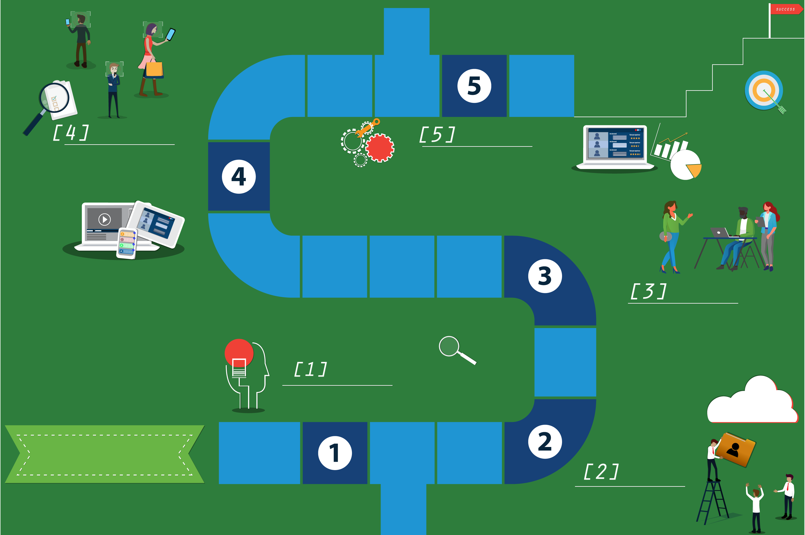

# SDLC

## Requirements analysis

> Requirements analysis means gaining a thorough understanding and list of requirements for how the app functions. In other words, what do you want the app to do.
>
> Kwame and Jenny want an app that customers can use to order food. Toni helps them list the functions that they want the app to perform. For example, choosing food from a menu.'

## Design

> There are two elements to the design of an app.
>
> 1. Technical design of the app itself; the code to make it work.
> 2. User-experience (UX) design, the look and feel of the application or how the user will experience using the app.
>
> Successful technical design of the app is critically dependent on a thorough requirements analysis. If completed properly, the requirements analysis helps Toni consider the best technical design for the app, for example, the database that contains the menu items, or the method of facilitating financial transactions when customers pay for food.

## Implementation

> During implementation, the app is built by the development team.
>
> This is where Toni and her team actually write code and program the app. They maintain close contact with Kwame and Jenny to ensure that the project is going in the right direction.

## Testing

> The testing phase ensures that everything works as expected.
>
> Toni’s team tests the app for code quality and efficiency to ensure that it works smoothly.
In addition to internal testing, the app can also be tested by a small group of customers to gather their feedback and input.

## Evolution

> The evolution phase occurs after the app is used by the customer for a certain amount of time. At this point, you assess what, if any, improvements might be made to keep the app current and fresh for users.
>
> Toni’s team monitors the software to ensure that if bugs or glitches are discovered, they can remedy them without delay by releasing updates of the app.

